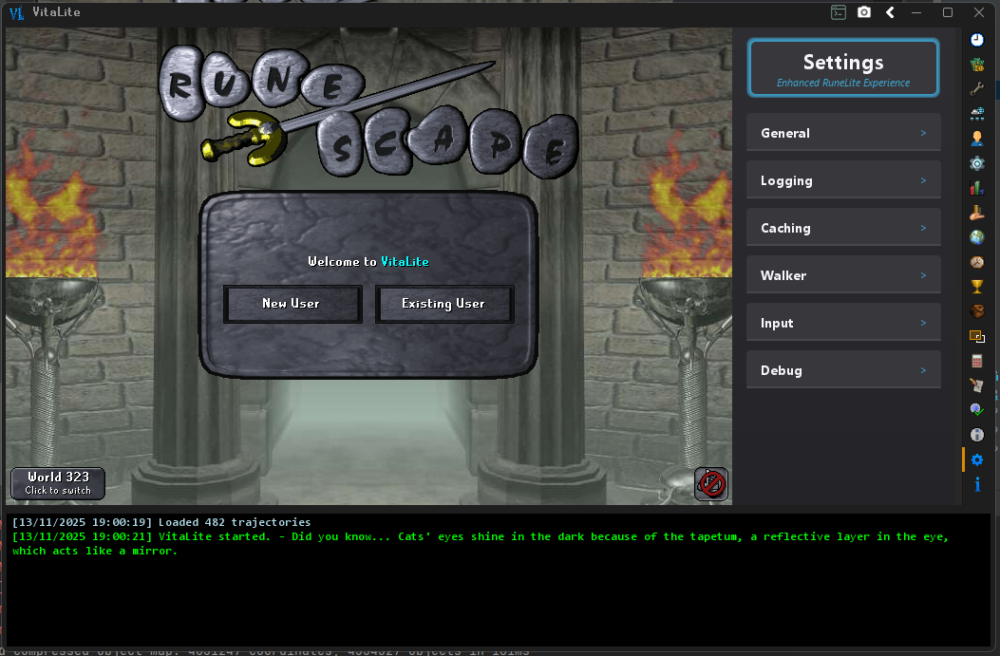

# VitaLite
VitaLite is a launcher for RuneLite that offers additional features and customization options.
- Provides access to aditional GamePack functionalities
- Robust built-in API SDK for plugin development
- Builtin plugins including profiles which allows you to use your Jagex Accounts directly from the client and swap between
- Dual-layered mixin system for modifying both RuneLites classes and the GamePack
- And more



## Side-Loading Plugins
- **External Plugin Support:** Load and manage external plugins not available in the official RuneLite repository.
  Add your plugins to the `~\.runelite\sideloaded-plugins` folder for them to load

## General User Release

[VitaLite Launcher](https://github.com/Tonic-Box/VitaLauncher/releases)

[Client QoL User Features](./docs/FEATURES.md)

## Developers
[SDK Docs](./docs/SDK-DOCS.md)

[Plugin Dev Guide](./docs/EXTERNALPLUGIN.md)

[Click Manager Docs](./docs/CLICKMANAGER.md)

[1.12.27 Release Notes](./docs/RELEASE-1.12.27.md)

### Building from source
**Requirements:** JDK 11
- Run `./gradlew :base-api:syncRuneliteApi` to download the target-pinned RuneLite API mirror after a rev update or on first build.
1. Run the `buildAndPublishAll` gradle task to build the artifacts and setup the main module correctly
2. Run the `com.tonic.VitaLite` main class to launch the client

### Run This 1.12.27 Update

This fork is pinned to RuneLite `1.12.27` by default, so you do not need to pass
`--targetBootstrap` for normal use.

```bash
./gradlew shadowJar
java -jar build/libs/VitaLite-1.12.27_0-shaded.jar -safeLaunch
```

You can still override the target manually when developing a future update:

```bash
java -jar build/libs/VitaLite-1.12.27_0-shaded.jar -safeLaunch --targetBootstrap 1.12.27
```

## Contributing
1. Fork the repository
2. Create a feature branch
3. Make your changes
4. Test thoroughly
5. Submit a pull request

## Client Command Line Options
| Option         | Type    | Description                                                                                       |
|----------------|---------|---------------------------------------------------------------------------------------------------|
| `-runInjector` | Boolean | Run the injector on startup and update patch diffs (for mixin development)                        |
| `--rsdump`     | String  | Path to dump the gamepack to (optional)                                                           |
| `--targetBootstrap` | String | Override the pinned RuneLite bootstrap version. Defaults to `1.12.27`                     |
| `-noPlugins`   | Boolean | Disables loading of core plugins                                                                  |
| `-min`         | Boolean | Runs JVM with minimal allotted memory.                                                            |
| `-noMusic`     | Boolean | Prevent the loading of music tracks                                                               |
| `-incognito`   | Boolean | Visually display as 'RuneLite' instead of 'VitaLite'                                              |
| `-help`        | Boolean | Displays help information about command line options                                              |
| `--legacyLogin` | String | Details for logging in (user:pass)                                                                |
| `--jagexLogin` | String | Details for logging in (sessionID:characterID:displayName) or path to RuneLite credentials file   |
| `--proxy`      | String  | Set a proxy server to use (e.g., ip:port or ip:port:username:password)                            |
| `-disableMouseHook` | Boolean | Disable RuneLite's mousehook rlicn DLL from being loaded or called |


## Disclaimer

VitaLite is a third-party loader for RuneLite. Use at your own risk. The developers are not responsible for any consequences resulting from the use of this software.

## [Buy me a coffee](https://ko-fi.com/tonicbox)
